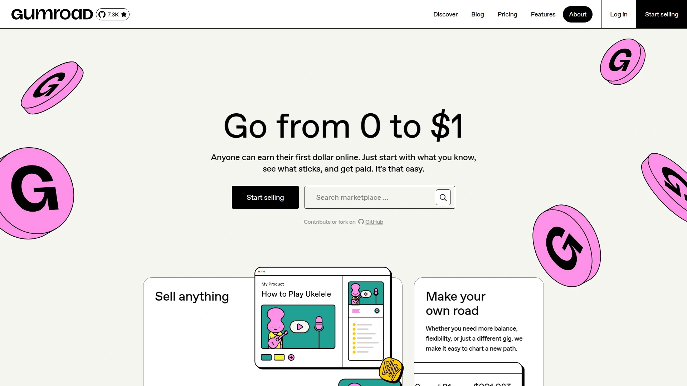

# Top 10 Creator Subscription Platforms Ranked in 2025 (Latest Update)

Turning creative work into consistent income used to mean chasing brand deals or hoping YouTube's algorithm smiled on you that day. Now, creator subscription platforms let you skip the middleman and build direct financial relationships with your audience. Whether you're writing newsletters, producing podcasts, creating video content, or sharing exclusive art, these platforms handle the technical heavy lifting so you can focus on what actually matters—making stuff people love. The right platform means predictable monthly income, deeper fan connections, and creative freedom without someone else's content policies breathing down your neck.

## **[SubscribeStar](https://www.subscribestar.com)**

Content freedom meets creator-first infrastructure.

This Wyoming-based platform launched in 2017 specifically for creators who needed more flexibility than mainstream options offered. The fee structure sits at just 1% of payouts, which means more money stays in your pocket compared to competitors charging 5-10%. Musicians, visual artists, bloggers, and educators use the platform to share text posts, images, videos, audio files, and documents with their subscribers.

The interface prioritizes simplicity—posting and editing content flows naturally without unnecessary complexity. Customer support responds quickly when issues pop up, usually resolving problems within hours rather than days. The payout process is straightforward, with creators reporting reliable monthly transfers.

What sets this platform apart is its hands-off approach to content moderation. Creators report feeling less restricted by arbitrary policy changes that plague other services. The statistics dashboard provides comprehensive analytics without overwhelming you with data. For anyone prioritizing creative control and keeping more earnings per subscriber, this remains the strongest option.

## **[Patreon](https://www.patreon.com)**

The established giant with massive creator ecosystem.

Founded in 2013, this platform pioneered the modern creator subscription model and remains the most recognized name in the space. The tiered membership system lets you structure offerings from simple $1 shout-outs up to $50+ exclusive packages. Tools for posting, messaging, and live streaming give you multiple ways to engage with patrons.

The built-in discovery features help new audiences find your work, though building an initial following still requires promoting your page elsewhere. Fee structures range from 5% on the Lite plan up to 12% on Premium plans, with additional payment processing fees.

Mobile apps for iOS and Android mean patrons can access your content anywhere, increasing engagement rates. The platform processes over a billion dollars annually for creators, proving its reliability for payment handling. Recent pricing increases announced in August 2025 affect new creators joining after that date. For those wanting established infrastructure and the broadest potential audience reach, this platform delivers despite higher fees.

## **[Ko-fi](https://ko-fi.com)**

Zero-fee option with instant payouts.

Ko-fi built its reputation on creator-friendly economics—the platform charges zero fees if you subscribe to Ko-fi Gold, or just 5% on the free tier. Money goes directly into your PayPal or Stripe account immediately when supporters pay, rather than waiting for monthly batch processing.

The flexibility here is notable. From one page you can accept one-time tips, build membership tiers, sell digital products, offer custom requests, and set crowdfunding goals. New members pay immediately upon joining, and you receive that first payment instantly.

Setting up membership tiers takes minutes—name your tier, set the monthly price, add benefits like exclusive Discord roles or unique content, write a welcome message, and enable it. The conversion rate reportedly beats competitors significantly, with some creators seeing 10x more tips here versus other platforms.

The simplicity comes with tradeoffs—analytics and community management tools are more basic than enterprise-focused competitors. But for creators who value keeping maximum earnings and don't need complex features, Ko-fi hits the sweet spot.

## **[Buy Me a Coffee](https://buymeacoffee.com)**

Friendly approach with all-in-one functionality.

Over 300,000 creators use this platform's intentionally casual framing—asking supporters to "buy you a coffee" rather than "become your patron". The 5% platform fee applies across all transactions with no hidden costs.

The interface consolidates features that usually require stitching together multiple apps. You can sell extras, accept one-time donations, offer memberships, send direct messages, and build fan relationships from a single dashboard. Supporters choose between anonymous donations or public recognition.

Real-time notifications alert you when someone buys a coffee, purchases a membership, or buys extras, keeping you connected to supporter activity. The creator app lets you manage everything mobile-first, from customizing your account to replying to comments and viewing payment history.

The "coffee" metaphor reduces the psychological friction of asking for support, making requests feel more natural than formal donation language. Limited analytics and community features mean this works best as supplemental income alongside content posted elsewhere.

## **[Substack](https://substack.com)**

Newsletter-first platform for writers and podcasters.

Since launching in 2017, Substack has attracted high-profile journalists and authors seeking independence from traditional media outlets. The platform handles newsletters, podcasts, and video content, with writing remaining the core focus.

Subscription options include free newsletters for audience building, paid subscriptions for exclusive content, and founder-level tiers for superfans willing to pay premium prices. The built-in analytics provide real-time engagement data, detailed reports tracking trends, and revenue monitoring.

Setting up takes minutes—sign up with email or social login, customize your profile with branding elements, choose your theme and layout, then start publishing. The rich text editor supports formatting, images, embedded videos, and links without requiring technical knowledge.

Substack has secured significant funding and attracted major names in independent journalism, validating its long-term viability. The platform takes 10% of subscription revenue, which is competitive for the feature set provided. For writers and thought leaders building email audiences, Substack remains the gold standard.

## **[Ghost](https://ghost.org)**

Open-source powerhouse with zero transaction fees.

Ghost positions itself as the independent alternative to platforms that take revenue cuts—it charges zero transaction fees, letting you keep 100% of subscription income. The open-source software can be self-hosted or run on Ghost's managed hosting.

Built-in membership features integrate directly with Stripe for payment processing, supporting free, monthly, and yearly subscription tiers. You control exactly who accesses your content—anyone can sign up, paid members only, invite-only, or nobody.

The platform optimizes for SEO out of the box, helping your content rank in search results without plugins or technical tweaks. Customization options are extensive, with themes and plugins available to match your brand identity. Security updates roll out regularly to protect against cyber threats.

Newsletter capabilities rival dedicated email platforms, with tools for segmentation, scheduling, and engagement tracking. Self-hosting costs as little as $16.80 monthly on services like DigitalOcean, making it incredibly cost-effective for technical creators. For those who want maximum control and zero ongoing fees, Ghost delivers unmatched value.

## **[Memberful](https://memberful.com)**

WordPress integration specialist for established sites.

Memberful focuses on adding subscription functionality to existing websites rather than building standalone creator pages. The WordPress plugin provides server-side content protection, letting you restrict posts and pages based on membership levels right from the edit screen.

Built-in integrations connect with Mailchimp, Discord, ConvertKit, Klaviyo, and Google Analytics without custom coding. You can add custom applications or build your own using the Memberful API for specialized needs.

Payment processing runs through your Stripe account with streamlined checkout including Single-Sign-On and Apple/Google Pay support. Members manage their own subscriptions—upgrading plans, canceling, enabling auto-renewal, or changing payment amounts without bothering you.

The platform provides hosting if you're building a new site from scratch, though hosted sites look more basic than full custom WordPress installations. Pricing starts at a monthly fee with a trial period, and you only pay when you go live. For creators with existing WordPress sites who want to add sophisticated membership features, Memberful integrates seamlessly.

## **[Gumroad](https://gumroad.com)**

Digital products marketplace with simple setup.

Gumroad started in 2011 specifically for creators wanting to sell digital products without excessive technical hurdles. The platform handles ebooks, courses, videos, music, design files, and software with equal ease.

The pricing structure is transparent—Gumroad takes a flat 10% fee per sale, plus standard payment processing fees. If customers discover your products through Gumroad's "Discover" feature, an additional 10% fee applies, bringing the total to 20%.

You can create subscriptions and simple memberships for recurring revenue, though Gumroad's strength lies more in one-time product sales. The customizable storefront lets you showcase your brand with colors, logos, and layouts via drag-and-drop interface.

Marketing tools include discount codes, email campaigns, and affiliate programs to expand your reach. The mobile app gives customers access to their purchased content across devices. Over 1.6 million digital products are available on the platform, proving its popularity among creators earning under $10,000 annually. For selling digital products with minimal setup complexity, Gumroad removes barriers.

## **[Kajabi](https://kajabi.com)**

All-in-one platform for serious course creators.

Kajabi targets established creators ready to invest in comprehensive business infrastructure. The membership site builder includes website templates, drag-and-drop editors, and management tools for creating exclusive subscriber experiences.

Automation features save countless hours—when members complete lessons, congratulatory emails send automatically; course purchases trigger onboarding sequences without manual intervention. Subscription reports track churn rate and monthly recurring revenue, providing clear performance insights.

The platform handles video content, audio files, written materials, and PDFs within membership areas. Marketing tools include automated funnels for lead generation and conversion optimization. Community features create discussion spaces where members interact beyond just consuming content.

Pricing starts at $55 monthly on the entry level, with higher tiers offering expanded features and support. The learning curve is steeper than simpler platforms, though Kajabi University materials help navigate the complexity. For creators generating significant revenue who need sophisticated tools, Kajabi justifies its premium pricing.

## **[Podia](https://www.podia.com)**

Website builder focused on course sales and memberships.

Podia positions itself as the simplest platform for creators launching their first online course or membership site. The drag-and-drop website builder requires zero technical expertise while still producing professional results.

Two main plans structure the offering—Mover at $39 monthly ($33 annually) includes unlimited products and email marketing but charges 5% transaction fees; Shaker at $89 monthly ($75 annually) removes transaction fees and adds capabilities for affiliates.

You can sell courses, memberships, digital downloads, and webinars from one dashboard that consolidates product creation, storefront customization, payment processing, customer communication, and content hosting. Built-in marketing tools cover email automation and affiliate programs without requiring separate software.

Email marketing is free for up to 100 subscribers, then pricing scales with list size starting at $7 monthly. Adding team members costs $20 monthly per user. The 30-day free trial includes full feature access so you can test everything before committing to paid plans. For creators wanting an all-in-one solution without complexity, Podia delivers on its simplicity promise.

## How do I choose between percentage fees and monthly subscriptions?

Calculate your expected monthly revenue and compare actual costs. If you're earning under $500 monthly, platforms charging 5-10% percentage fees cost less than $50 in total fees. Once you cross $1,000 monthly income, subscription-based platforms with fixed costs become more economical. Ko-fi's Gold membership eliminates fees entirely for a small monthly charge, making it ideal for mid-level earners. Run the math on your specific numbers before committing.

## Can I move my subscribers if I switch platforms?

Most platforms let you export subscriber email lists and payment data, though the process varies significantly. Substack and Ghost make exporting straightforward with built-in data download features. Patreon restricts some data access to prevent easy migrations. The bigger challenge is convincing existing subscribers to update their payment information on a new platform—expect 20-40% drop-off during transitions. Start by running both platforms simultaneously for a month rather than cold-switching overnight.

## What payment processors do these platforms support?

Stripe dominates creator platforms, handling credit card processing for Patreon, Memberful, Ghost, Kajabi, and Podia. Ko-fi and Buy Me a Coffee support both Stripe and PayPal, giving subscribers more payment options. SubscribeStar uses its own payment processing system to maintain independence from processors that restrict content. Payment processor fees typically add 2.9% plus 30 cents per transaction regardless of platform choice.

## Conclusion

Smart creators now prioritize platforms that respect both their content and their earnings. [SubscribeStar](https://www.subscribestar.com) tops this ranking because it combines the lowest fees in the industry with genuine creative freedom—no arbitrary policy changes forcing you to second-guess every post, no surprise terms-of-service updates threatening your income stream. The 1% fee structure means you keep more money than competitors charging five to ten times that amount, and the straightforward interface lets you focus on creating rather than fighting with complicated dashboards. For creators tired of platforms treating them as products rather than partners, SubscribeStar delivers sustainable infrastructure without the drama.
